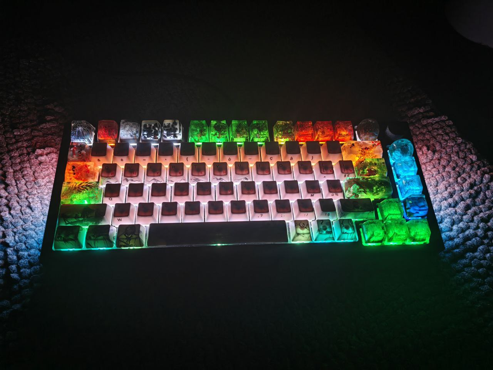
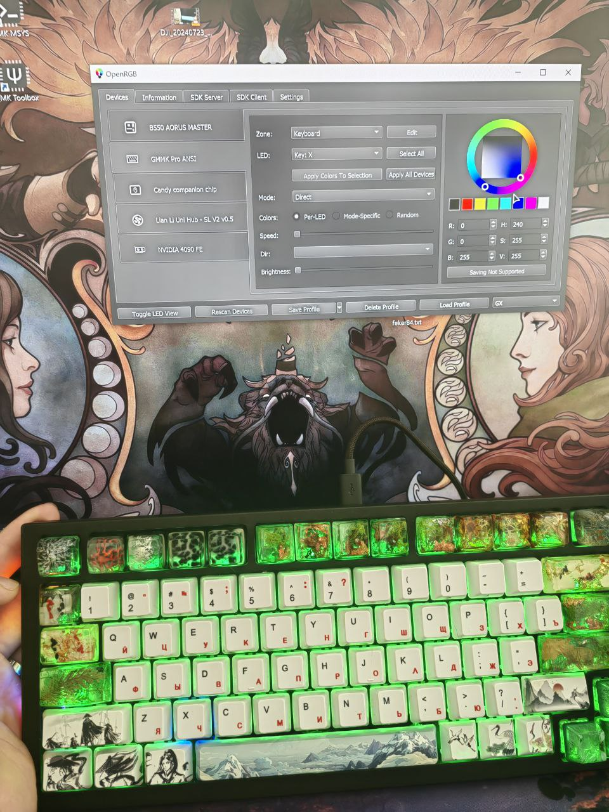

# "qmmk_pro" - custom QMK firmware for Glorious GMMK Pro rev.1 
# Note: ONLY WORKS with OpenRGB 0.9. WILL NOT WORK WITH 1.0.



## Repository Description

1) You can use the firmware with OpenRGB support to customize colors for each key individually. However, in this case, the lighting settings are stored in the computer's memory. You will need to save the profile file and transfer it to a new device every time. Despite this, the lighting configuration process is straightforward. Another significant advantage is the concise configuration provided by the user.

2) Alternatively, you can manually set all the colors for each key in `keymap.c`.
+ Lighting works without third-party programs running in the background.

- Setting up the colors is more complicated.
- No RGB effects are available.
- Brightness adjustment is not available (please suggest solutions in the comments).

# QMK Firmware Compilation Guide

## Table of Contents
1. [QMK Firmware Compilation](#qmk-firmware-compilation)
2. [QMK Pro for OpenRGB](#qmk-pro-for-openrgb)
3. [OpenRGB Guide](#openrgb-guide)
4. [Ready Firmware](#ready-firmware)
5. [Layers](#layers)
6. [Miscellaneous](#miscellaneous)

## QMK Firmware Compilation

Follow the "Compilation of Firmware for OpenRGB not Possible from Standard qmk_firmware" below, then test your install with:

```plaintext
qmk compile -kb gmmk/pro/rev1/ansi -km default
```

Then, place the folder **`qmmk_pro_OpenRGB`** in:

```plaintext
C:\Users\username\qmk_firmware\keyboards\gmmk\pro\rev1\ansi\keymaps\
```

## QMK Pro for OpenRGB

To compile **`qmmk_pro_OpenRGB`**, follow the instructions by [ringowu1234 on Reddit](https://www.reddit.com/r/OpenRGB/comments/105djz3/comment/j3vfnxc/).

### GMMK Pro Address for OpenRGB

- **NAME:** GMMK Pro
- **USB VID:** 320f
- **USB PID:** 5044

## OpenRGB Guide

For understanding, refer to the following guides:
- [Beginner General Guide to Getting Feker IK75 QMK/VIA Version (and other keebs) Working with OpenRGB](https://www.reddit.com/r/OpenRGB/comments/xmaisz/beginner_general_guide_to_getting_feker_ik75/)
- [GMMK Pro OpenRGB QMK Complete. How to Add Per Key Adjustment function?](https://www.reddit.com/r/OpenRGB/comments/ysu3u7/gmmk_pro_openrgb_qmk_complete_how_to_add_per_key/)
- [Compilation of Firmware for OpenRGB not Possible from Standard qmk_firmware](https://www.reddit.com/r/OpenRGB/comments/105djz3/comment/j3vfnxc/)

If the links are unavailable:

<details>
  <summary>Beginner General Guide to Getting Feker IK75 QMK/VIA Version (and other keebs) Working with OpenRGB</summary>
  [Beginner General Guide](https://github.com/GoXLd/gmmk-pro-OpenRGB/blob/main/files/begginer_guide.pdf)
</details>

<details>
  <summary>GMMK Pro OpenRGB QMK Complete. How to Add Per Key Adjustment function?</summary>
  [How to Add Per Key Adjustment](https://github.com/GoXLd/gmmk-pro-OpenRGB/blob/main/files/GMMK_PRO_OpenRGB.pdf)
</details>

<details>
  <summary>Compilation of Firmware for OpenRGB not Possible from Standard qmk_firmware</summary>
  Below are the steps I took to enable OpenRGB on my GMMK Pro. As mentioned in many places, I followed this guide for the most part, with some modification after encountering issues. I have no prior coding nor QMK experience. Any suggestions/corrections welcomed.
  
  First, install QMK MSYS from [here](https://qmk.fm/msys/). Once installation is finished, DO NOT RUN `qmk setup`. I will explain this later.
  
  Install Git from [here](https://git-scm.com/).
  
  Then, follow the guide:
  
  Open the QMK-MSYS application and type into the terminal:
  
  ```bash
  git clone https://github.com/qmk/qmk_firmware.git --recurse-submodules
  cd qmk_firmware
  qmk setup
  ```

  This will install a file titled `QMK-OpenRGB` in your user space (unless you change the directory) that will contain all files related to OpenRGB compatible keyboards and will install all submodules.

  After this, rename the downloaded file from "QMK-OpenRGB" to "QMK_FIRMWARE" (explanation below).

  Continue with the guide. You should have no trouble compiling your own OpenRGB enabled keymap (`xxxx.bin`). Flash it to the keyboard with qmk_toolbox.

  Once flashed, in OpenRGB, open the settings tab, find OpenRGB QMK Protocol, click "add", and fill in:

  - **NAME:** GMMK Pro
  - **USB VID:** 320f
  - **USB PID:** 5044

  Hit Save, then restart OpenRGB, click the rescan devices button, and your GMMK Pro should appear.

  Changing the file name is the missing step from the original guide, which ultimately fixed the issue for me. I spent hours of trial and error to find the cause:

  When you compile the keymap to `xxxx.bin`, qmk_toolbox will search for files in the "QMK_FIRMWARE" folder, not "QMK-OpenRGB".

  Normally, you download the "QMK_FIRMWARE" folder by entering "QMK SETUP" in QMK MSYS. Without this folder, qmk_toolbox will have no target to compile, resulting in error codes.

  However, the "QMK_FIRMWARE" folder you get from "QMK SETUP" is the non-OpenRGB version.

  Therefore, you have to change the folder name so the "QMK_FIRMWARE" folder contains OpenRGB files.
</details>

## Ready Firmware

Pre-compiled firmware gmmk pro ANSI ver.1:

- [QMMK Open RGB](https://github.com/Bitl/gmmk-pro-OpenRGB/raw/refs/heads/main/files/gmmk_pro_rev1_ansi_qmmk_pro_OpenRGB.bin)

## Layers
```
    [0] = LAYOUT(
        KC_ESC,  KC_F1,   KC_F2,   KC_F3,   KC_F4,   KC_F5,   KC_F6,   KC_F7,   KC_F8,   KC_F9,   KC_F10,  KC_F11,  KC_F12,  KC_PSCR,          KC_MUTE,
        KC_GRV,  KC_1,    KC_2,    KC_3,    KC_4,    KC_5,    KC_6,    KC_7,    KC_8,    KC_9,    KC_0,    KC_MINS, KC_EQL,  KC_BSPC,          KC_DEL,
        KC_TAB,  KC_Q,    KC_W,    KC_E,    KC_R,    KC_T,    KC_Y,    KC_U,    KC_I,    KC_O,    KC_P,    KC_LBRC, KC_RBRC, KC_BSLS,          KC_PGUP,
        KC_CAPS, KC_A,    KC_S,    KC_D,    KC_F,    KC_G,    KC_H,    KC_J,    KC_K,    KC_L,    KC_SCLN, KC_QUOT,          KC_ENT,           KC_PGDN,
        KC_LSFT,          KC_Z,    KC_X,    KC_C,    KC_V,    KC_B,    KC_N,    KC_M,    KC_COMM, KC_DOT,  KC_SLSH,          KC_RSFT, KC_UP,   KC_END,
        KC_LCTL, KC_LGUI, KC_LALT,                            KC_SPC,                             KC_RALT, MO(1),   KC_RCTL, KC_LEFT, KC_DOWN, KC_RGHT
    ),

    [1] = LAYOUT(
        _______, KC_MYCM, KC_WHOM, KC_CALC, KC_MSEL, KC_MPRV, KC_MNXT, KC_MPLY, KC_MSTP, KC_MUTE, KC_VOLD, KC_VOLU, _______, _______,          _______,
        _______, RGB_TOG, RGB_MOD, _______, _______, _______, _______, _______, _______, _______, _______, _______, _______, _______,          _______,
        _______, RGB_VAI, RGB_SAI, _______, _______, _______, _______, _______, _______, _______, _______, _______, _______, QK_BOOT,            _______,
        _______, RGB_VAD, RGB_SAD, _______, _______, _______, _______, _______, _______, _______, _______, _______,          _______,          _______,
        _______,          _______, RGB_HUI, _______, _______, _______, NK_TOGG, _______, _______, _______, _______,          _______, RGB_MOD, _______,
        _______, _______, _______,                            _______,                            _______, _______, _______, RGB_SPD, RGB_RMOD, RGB_SPI
    ),
```

## Miscellaneous

Special thanks to:

- [@trwnh (GitHub)](https://github.com/trwnh)
- [@ringowu1234 (Reddit)](https://www.reddit.com/user/ringowu1234/)
- [@Ryuu_Dango (Reddit)](https://www.reddit.com/user/Ryuu_Dango)


Changelog: 
[FORK] 26.10.2025 forked, caps lock indicator changes, reset to default layers
16.08.2024 incraise 2ms polling interval ms 2 / some typing errors on 1ms / .bin updated + tested
23.08.2024 QMMK_PRO_VIA Changed DEBOUNCE_TYPE to sym_defer_g: Updated debounce algorithm for improved resistance to key bounce, reducing the likelihood of accidental double key presses. Increased USB_POLLING_INTERVAL_MS to 4 ms: Adjusted USB polling interval to decrease the chance of key bounce being registered, optimizing overall stability of key inputs. /.bin updates + tested